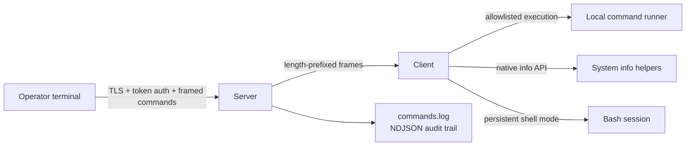
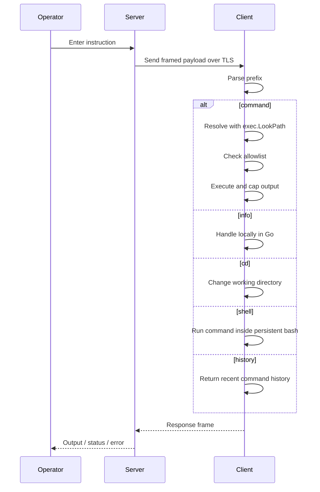
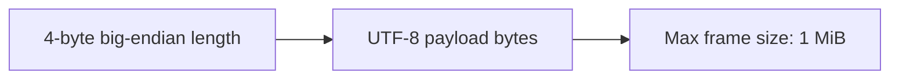

# TCP Mini-TP

A production-grade TCP command channel written in Go.

The operator types instructions in a terminal, the server forwards them over a length-prefixed protocol, and the client executes only what is allowed. Every connection is encrypted with TLS, every command is authenticated, and every action is audited.

## At a Glance

- TLS protects the transport end to end.
- A shared token is required before any command can run.
- Commands are routed through a strict instruction set: `command`, `info`, `cd`, `shell`, `history`, and `exit`.
- A single active session is enforced on the server.
- Command output is capped at 64 KB to keep the server responsive.
- Commands are written to `commands.log` as newline-delimited JSON.

## Architecture



The server owns session control, authentication, auditing, and heartbeat management. The client owns command execution, native info commands, shell mode, and reconnect logic.

## Message Flow



## Features

| Area | What it does |
| --- | --- |
| Transport security | TLS is enabled by default. The server auto-generates a self-signed certificate on first run. |
| Authentication | A pre-shared token must match before the session is accepted. |
| Single-session control | Only one active client can connect at a time. Concurrent sessions are rejected. |
| Heartbeat | The server sends periodic pings and closes stale sessions when pongs stop arriving. |
| Reconnect strategy | The client retries with exponential backoff until it reconnects or exhausts its limit. |
| Allowlisted execution | `command <name> ...` runs only approved commands resolved with `exec.LookPath`. |
| Native info commands | `info os`, `info env`, `info uptime`, and `info memory` are handled locally without spawning a shell. |
| Shell mode | `shell` opens a persistent Bash session; `shell exit` closes it cleanly. |
| History and audit | `history` shows the most recent commands, and every command is appended to `commands.log`. |
| Output safety | Command output is capped at 64 KB so a noisy process cannot flood the session. |

## Instruction Set

| Prefix | Example | Behavior |
| --- | --- | --- |
| `command` | `command whoami` | Runs an allowlisted binary on the client. |
| `info` | `info uptime` | Returns system information directly from Go. |
| `cd` | `cd /tmp` | Changes the client working directory. |
| `shell` | `shell` | Enters persistent shell mode. |
| `history` | `history` | Prints the latest recorded commands. |
| `exit` | `exit` | Ends the session. |

## Protocol

Every message is framed as a 4-byte big-endian length header followed by the UTF-8 payload.



That design avoids newline parsing, partial reads, and message boundary ambiguity on raw TCP streams.

## Quickstart

### Requirements

- Go 1.22 or newer
- Make

### Build

```bash
git clone https://github.com/AnouarMohamed/TCP.git
cd TCP
make build
```

Binaries are written to `bin/`.

### Run

Start the server:

```bash
go run ./server -listen :9898 -token s3cr3t
```

Then connect the client:

```bash
go run ./client -server localhost:9898 -token s3cr3t
```

## Screenshot Gallery

All screenshots live in `screenshots/`.

### Session setup

| Server | Client |
| --- | --- |
|  |  |
| The server starts, generates its certificate, and logs a structured `listener_started` event. | The client connects, performs TLS, and authenticates with the shared token. |

### Command execution

| Allowed command | Output examples |
| --- | --- |
|  | `command whoami` executes over the encrypted channel. |
|  | `command pwd` returns the client-side working directory. |
|  | `command ls` shows the client filesystem, including the local TLS assets. |

### Enforcement and local APIs

| Policy check | Native info API |
| --- | --- |
|  |  |
| `curl` is rejected because it is not in the allowlist, even when the binary is resolved through `exec.LookPath`. | `info os`, `info memory`, and `info uptime` are answered directly in Go without spawning a subprocess. |

### Operational tools

| History | Reconnect |
| --- | --- |
|  |  |
| The REPL can show the most recent commands while the same entries are also written to `commands.log`. | When the server disappears, the client retries with exponential backoff until it reconnects or gives up. |

### Authentication and recovery

| Wrong token | Server restart |
| --- | --- |
|  |  |
| A wrong token is rejected at the application layer after TLS completes. | The server can be restarted and reused without changing the protocol or client workflow. |

### Security validation

| Encrypted traffic | Certificate proof |
| --- | --- |
|  |  |
| Packet capture shows encrypted traffic rather than readable commands or responses. | The generated certificate is a real X.509 certificate, not a placeholder file. |

| Certificate rejection | Test run |
| --- | --- |
|  |  |
| A wrong certificate path fails before the TLS session is established. | The test suite runs across all packages with the race detector enabled. |

| Coverage |
| --- |
|  |
| Coverage is tracked with `go test -coverprofile=coverage.out ./...` and visualized with `go tool cover -html=coverage.out`. |

## Project Layout

```text
.
├── client/
│   ├── main.go
│   ├── info.go
│   └── shell.go
├── internal/
│   └── protocol/
├── screenshots/
├── server/
├── Makefile
└── go.mod
```

## Testing

```bash
go test ./...
go test -race ./...
go build ./server ./client
```

## Security Notes

- The token is compared with `crypto/subtle.ConstantTimeCompare`.
- Command resolution uses `exec.LookPath` before the allowlist check, which blocks path traversal tricks.
- Output is capped at 64 KB so a runaway command cannot flood the session.
- `info env` redacts common secret-like keys such as `TOKEN`, `SECRET`, `KEY`, and `PASS`.
- The project is intended for educational and authorised lab use only.

## Demo Assets

The screenshots in `screenshots/` are part of the README demo and can be replaced with your own captures later if you want a different presentation.